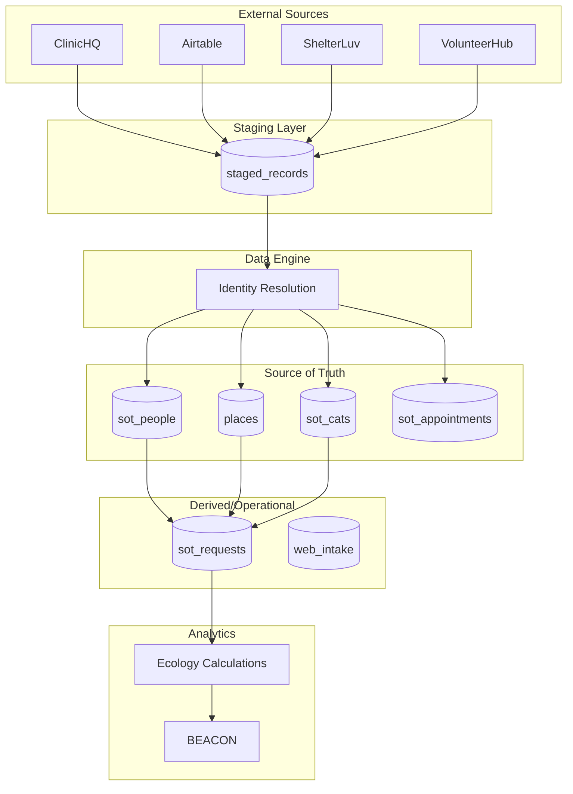

# Atlas Data Flow Architecture

This document describes how data flows through Atlas from external sources to Beacon analytics.

## High-Level Architecture

```
┌─────────────────────────────────────────────────────────────────┐
│  EXTERNAL SOURCES (outside Atlas)                               │
│  ClinicHQ │ Airtable │ ShelterLuv │ VolunteerHub               │
└──────┬────────┬──────────┬────────────┬─────────────────────────┘
       │        │          │            │
       ↓        ↓          ↓            ↓
┌─────────────────────────────────────────────────────────────────┐
│  STAGING LAYER                                                  │
│  staged_records (immutable staging with row_hash deduplication) │
└──────────────────────────┬──────────────────────────────────────┘
                           │
                           ↓
┌──────────────────────────────────────────────────────────────────┐
│                      DATA ENGINE (MIG_314-317)                    │
│  • Identity resolution    • Multi-signal scoring                  │
│  • Junk detection         • Household modeling                    │
│  • Survivorship rules     • Audit trail                          │
└──────────────────────────┬───────────────────────────────────────┘
                           │
         ┌─────────────────┼─────────────────┐
         ↓                 ↓                 ↓
    ┌─────────┐      ┌─────────┐      ┌─────────┐      ┌────────────┐
    │ PEOPLE  │      │  CATS   │      │ PLACES  │      │APPOINTMENTS│
    │sot_people│     │sot_cats │      │ places  │      │sot_appts   │
    └────┬────┘      └────┬────┘      └────┬────┘      └─────┬──────┘
         │                │                │                  │
         └────────────────┴────────────────┴──────────────────┘
                           │
         ┌─────────────────┼─────────────────┐
         ↓                 ↓                 ↓
    ┌─────────┐      ┌─────────┐      ┌────────────┐
    │REQUESTS │      │ INTAKE  │      │CAT HISTORY │
    │sot_reqs │      │web_intake│     │cat_place_* │
    └────┬────┘      └────┬────┘      └─────┬──────┘
         │                │                  │
         └────────────────┴──────────────────┘
                           │
                           ↓
              ┌────────────────────────┐
              │  ECOLOGY CALCULATIONS  │
              │  place_colony_estimates│
              │  cat_birth/death_events│
              └───────────┬────────────┘
                          │
                          ↓
              ┌────────────────────────┐
              │        BEACON          │
              │   Population Modeling  │
              └────────────────────────┘
```

## Data Flow Legend

| Color | Data Type |
|-------|-----------|
| Red | People Data |
| Purple | Cat Data |
| Green | Location Data |
| Blue | Appointments |
| Orange | Adoption/Outcome Data |

---

## Layer 1: External Sources

### ClinicHQ
**Entry Point:** `scripts/ingest/clinichq_*.mjs`

| Data Type | Description | Quality Notes |
|-----------|-------------|---------------|
| Appointments | Ground truth for spay/neuter | High confidence |
| Cat/Microchip | Verified cat identification | Gold standard for cats |
| Owner Info | Contact details from intake forms | Messy - split first/last issues |
| Location | Owner addresses | Often uses FFSC address for "public" |

**Known Issues:**
- Owner info is messy (super messy first/last name parsing)
- Microchips stored in weird places in the data
- Many "public" appointments use clinic address

### Airtable
**Entry Point:** `scripts/ingest/airtable_*.mjs`

| Data Type | Description | Quality Notes |
|-----------|-------------|---------------|
| Requests | Trapping requests | Old connections sometimes lost |
| Trappers | Volunteer trappers | Record structure has changed over time |
| Project 75 | Survey data | Historical context |

**Known Issues:**
- Old connections lost due to record structure changes
- Many public submissions with incomplete data

### ShelterLuv
**Entry Point:** `scripts/ingest/shelterluv_api_sync.mjs`

| Data Type | Description | Quality Notes |
|-----------|-------------|---------------|
| Cat Microchip | Additional cat identification | Supplements ClinicHQ |
| Adopter/Outcome | Adoption records | Links cats to new owners |
| Cat Medical | Medical history | Historical context |
| Foster Data | Foster placements | Links cats to foster homes |

**Known Issues:**
- Software used as POS terminal at clinic
- Should have all cats but some may be missing

### VolunteerHub
**Entry Point:** `scripts/ingest/volunteerhub_users_xlsx.mjs`

| Data Type | Description | Quality Notes |
|-----------|-------------|---------------|
| People | Volunteer contact info | Some manually added |
| Addresses | Volunteer locations | Variable quality |
| Phone Numbers | Contact numbers | Messy public sign-ups |

**Known Issues:**
- Some people added manually to get into system
- Missing data due to public sign-up process

---

## Layer 2: Staging

All external data flows through the `staged_records` table before processing.

```sql
-- Staging table structure
trapper.staged_records (
  record_id       UUID,
  source_system   TEXT,      -- 'clinichq', 'airtable', 'shelterluv', etc.
  source_table    TEXT,      -- specific table/entity type
  payload         JSONB,     -- raw data
  row_hash        TEXT,      -- for deduplication
  created_at      TIMESTAMP,
  processed_at    TIMESTAMP  -- NULL until processed
)
```

### Staging Benefits
1. **Immutable audit trail** - Raw data preserved
2. **Deduplication** - row_hash prevents duplicate processing
3. **Reprocessing** - Can re-run processors on staged data
4. **Debugging** - Original payload available for investigation

---

## Layer 3: Data Engine

The Data Engine (MIG_314-317) provides unified identity resolution for all entity creation.

### Multi-Signal Scoring

When creating/matching people, the Data Engine scores candidates using:

| Signal | Weight | Description |
|--------|--------|-------------|
| Email | 40% | Exact match on normalized email |
| Phone | 25% | Exact match on normalized phone |
| Name | 25% | Fuzzy matching on names |
| Address | 10% | Location proximity |

### Decision Types

| Decision | Score Range | Action |
|----------|-------------|--------|
| `auto_match` | >= 0.95 | Automatically link to existing person |
| `review_pending` | 0.50 - 0.94 | Create new, flag for human review |
| `household_member` | 0.50+ (low name) | Create new, add to household |
| `new_entity` | < 0.50 | Create new person |
| `rejected` | N/A | Internal account or junk data |

### Centralized Functions

**All entity creation MUST use these functions:**

```sql
-- Person creation (goes through Data Engine)
trapper.find_or_create_person(email, phone, first, last, addr, source)

-- Place creation (with deduplication)
trapper.find_or_create_place_deduped(address, name, lat, lng, source)

-- Cat creation (microchip-based)
trapper.find_or_create_cat_by_microchip(chip, name, sex, breed, ...)

-- Request creation (with attribution windows)
trapper.find_or_create_request(source, record_id, source_created_at, ...)
```

See [CENTRALIZED_FUNCTIONS.md](./CENTRALIZED_FUNCTIONS.md) for detailed documentation.

---

## Layer 4: Source of Truth (SOT) Tables

### sot_people
All people who have interacted with FFSC.

**Key Fields:**
- `person_id` - UUID primary key
- `display_name` - Full name
- `primary_email`, `primary_phone` - Contact info
- `source_system` - Where data originated
- `merged_into_person_id` - For merged duplicates

**Related Tables:**
- `person_identifiers` - Email/phone for identity matching
- `person_roles` - trapper, volunteer, staff, etc.
- `person_place_relationships` - Links to addresses

### sot_cats
All cats with microchips seen at FFSC clinic.

**Key Fields:**
- `cat_id` - UUID primary key
- `display_name` - Cat name
- `sex`, `breed`, `altered_status` - Cat attributes
- `merged_into_cat_id` - For merged duplicates

**Related Tables:**
- `cat_identifiers` - Microchip numbers
- `cat_place_relationships` - Links to locations
- `cat_procedures` - Medical procedures

### places
All physical locations in the system.

**Key Fields:**
- `place_id` - UUID primary key
- `formatted_address` - Full address
- `normalized_address` - For deduplication
- `latitude`, `longitude` - Coordinates
- `merged_into_place_id` - For merged duplicates

**Related Tables:**
- `place_contexts` - Context tags (colony_site, foster_home, etc.)
- `place_colony_estimates` - Population estimates

### sot_appointments
Clinic appointments (ground truth from ClinicHQ).

**Key Fields:**
- `appointment_id` - UUID primary key
- `appointment_date` - When the appointment occurred
- `cat_id` - Link to cat
- `trapper_person_id` - Link to trapper who brought cat
- `is_spay`, `is_neuter` - Procedure flags

---

## Layer 5: Derived/Operational Tables

### sot_requests
Service requests derived from People + Places.

**Creation Flows:**
1. **Native UI Creation:** `/api/requests` POST → `raw_intake_request` → `promote_intake_request()` → `find_or_create_person()` + `find_or_create_place_deduped()` → `sot_requests`

2. **Intake Conversion:** `/api/intake/convert` POST → `convert_intake_to_request()` → Same flow as above

3. **Airtable Sync:** `airtable_*_sync.mjs` → `staged_records` → `find_or_create_request()` → `sot_requests`

**Key Fields:**
- `request_id` - UUID primary key
- `place_id` - Location of request
- `requester_person_id` - Who made the request
- `status` - new, triaged, scheduled, completed, etc.
- `source_created_at` - For attribution windows

### web_intake_submissions
Raw web form submissions before conversion to requests.

**Flow:**
```
Public Form → web_intake_submissions → (triage) → convert_intake_to_request() → sot_requests
```

---

## Layer 6: Ecology & Beacon

### Colony Estimates

Population estimates are stored in `place_colony_estimates`:

```sql
place_colony_estimates (
  estimate_id     UUID,
  place_id        UUID,
  total_cats      INTEGER,
  source_type     TEXT,      -- verified_cats, trapper_site_visit, etc.
  observation_date DATE,
  confidence      NUMERIC
)
```

### Source Confidence Levels

| Source Type | Confidence | Description |
|-------------|------------|-------------|
| `verified_cats` | 100% | Ground truth from clinic |
| `post_clinic_survey` | 85% | Project 75 surveys |
| `trapper_site_visit` | 80% | Trapper observations |
| `trapping_request` | 60% | Request estimates |
| `intake_form` | 55% | Web intake estimates |

### Beacon Data Pipeline

```
┌──────────────────────────────────────────────────────┐
│ place_colony_estimates                                │
│ cat_birth_events (from lactating appointments)        │
│ cat_mortality_events (from euthanasia records)        │
│ site_observations (mark-resight data)                 │
└──────────────────────┬───────────────────────────────┘
                       │
                       ↓
┌──────────────────────────────────────────────────────┐
│ ECOLOGY CALCULATIONS                                  │
│ • Chapman mark-recapture estimator                    │
│ • Population growth modeling                          │
│ • Configurable parameters (ecology_config)            │
└──────────────────────┬───────────────────────────────┘
                       │
                       ↓
┌──────────────────────────────────────────────────────┐
│ BEACON VISUALIZATION                                  │
│ • Colony size estimates by location                   │
│ • Population trends over time                         │
│ • TNR coverage metrics                                │
└──────────────────────────────────────────────────────┘
```

---

## Processing Pipeline

### Job Queue System

All data processing uses a centralized job queue:

```sql
trapper.processing_jobs (
  job_id          UUID,
  source_system   TEXT,
  source_table    TEXT,
  job_type        TEXT,      -- 'ingest', 'backfill', 'link'
  status          TEXT,      -- 'pending', 'processing', 'completed', 'failed'
  batch_id        TEXT,
  created_at      TIMESTAMP,
  started_at      TIMESTAMP,
  completed_at    TIMESTAMP
)
```

### Processing Flow

```
1. CLI/API stages data → staged_records
2. enqueue_processing() → processing_jobs
3. process_next_job() claims job (FOR UPDATE SKIP LOCKED)
4. Routes to appropriate processor:
   ├─ clinichq/* → process_clinichq_*()
   ├─ airtable/* → data_engine_process_batch()
   ├─ shelterluv/* → process_shelterluv_*()
   └─ volunteerhub/* → process_volunteerhub_users()
5. run_all_entity_linking() → Links cats to places, appointments to trappers
```

### Monitoring

- **Endpoint:** `/api/health/processing`
- **View:** `v_processing_dashboard`

```sql
-- Check processing status
SELECT * FROM trapper.v_processing_dashboard;

-- Queue a backfill job
SELECT trapper.enqueue_processing('clinichq', 'owner_info', 'backfill', NULL, 10);

-- Process next job
SELECT * FROM trapper.process_next_job(500);
```

---

## Mermaid Diagram



---

## Key Principles

### 1. Ground Truth Priority
FFSC clinic data (ClinicHQ) is the gold standard for:
- Cat identification (microchips)
- Alteration status (spay/neuter verified)
- Appointment history

### 2. Identity Resolution Rules
- **Email/Phone only** - Never match people by name alone
- **Multi-signal scoring** - Combines all available signals
- **Household modeling** - Multiple people at same address

### 3. No Direct SOT Writes
All entity creation must go through centralized functions:
- `find_or_create_person()` → Data Engine
- `find_or_create_place_deduped()`
- `find_or_create_cat_by_microchip()`
- `find_or_create_request()`

### 4. Audit Everything
- `staged_records` preserves raw data
- `entity_edits` logs changes
- `data_engine_match_decisions` records identity decisions
- `intake_audit_log` tracks request promotions

---

## Related Documentation

- [CENTRALIZED_FUNCTIONS.md](./CENTRALIZED_FUNCTIONS.md) - Detailed function documentation
- [ATLAS_MISSION_CONTRACT.md](./ATLAS_MISSION_CONTRACT.md) - Core mission principles
- [INGEST_GUIDELINES.md](./INGEST_GUIDELINES.md) - Data ingestion rules
- [TIPPY_VIEWS_AND_SCHEMA.md](./TIPPY_VIEWS_AND_SCHEMA.md) - Tippy schema navigation
