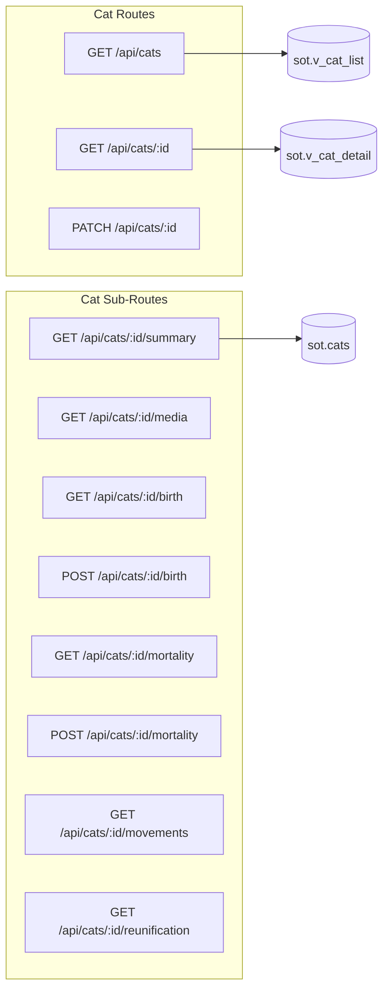
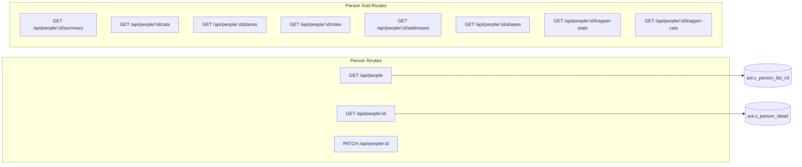
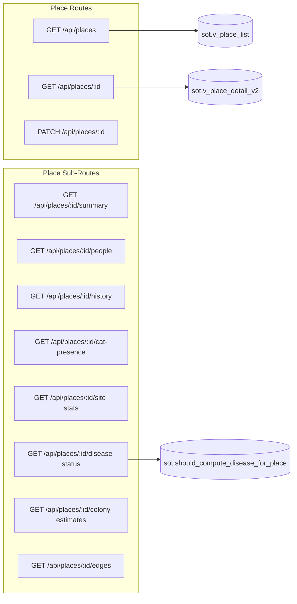
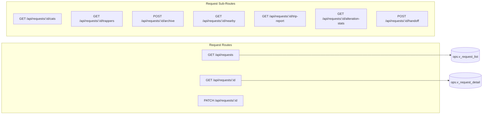
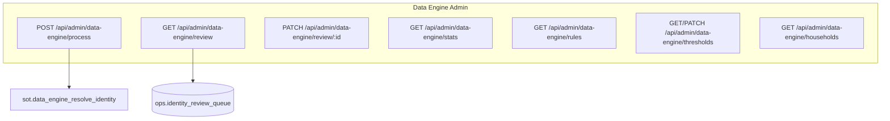
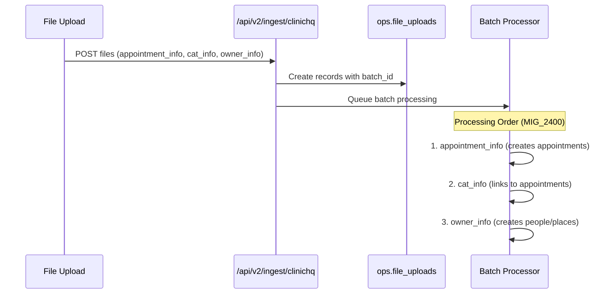
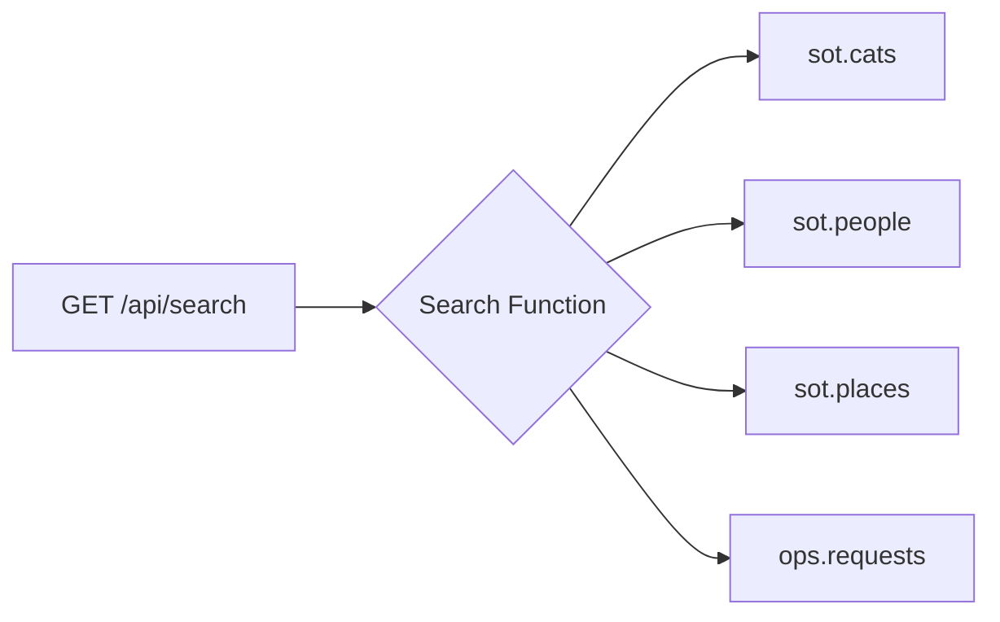

# Atlas API Routes Map

High-resolution map of all API routes with handlers, database interactions, and response shapes.

## Response Format Standard

All routes use standardized response format (see `@/lib/api-response.ts`):

```typescript
// Success
{
  success: true,
  data: T,
  meta?: { total, limit, offset, hasMore }
}

// Error
{
  success: false,
  error: { message, code, details? }
}
```

## Validation Helpers

| Helper | Location | Purpose |
|--------|----------|---------|
| `requireValidUUID(id, entityType)` | `@/lib/api-validation.ts:43` | Validate UUID parameter, throws 400 |
| `parsePagination(searchParams)` | `@/lib/api-validation.ts:63` | Parse limit/offset with bounds |
| `requireValidEnum(value, values, field)` | `@/lib/api-validation.ts:100` | Validate enum value |
| `withErrorHandling(handler)` | `@/lib/api-validation.ts:145` | Wrapper for consistent error handling |
| `parseBody(request, schema)` | `@/lib/api-validation.ts:224` | Zod schema validation |

## Core Entity Routes

### Cats `/api/cats`



| Route | Method | File | View/Table | SQL Functions |
|-------|--------|------|------------|---------------|
| `/api/cats` | GET | `src/app/api/cats/route.ts` | `sot.v_cat_list` | - |
| `/api/cats/[id]` | GET | `src/app/api/cats/[id]/route.ts` | `sot.v_cat_detail` | - |
| `/api/cats/[id]` | PATCH | `src/app/api/cats/[id]/route.ts` | `sot.cats` | - |
| `/api/cats/[id]/summary` | GET | `src/app/api/cats/[id]/summary/route.ts` | `sot.cats`, `ops.appointments` | - |
| `/api/cats/[id]/media` | GET | `src/app/api/cats/[id]/media/route.ts` | `sot.cat_media` | - |
| `/api/cats/[id]/birth` | GET/POST | `src/app/api/cats/[id]/birth/route.ts` | `sot.cat_birth_records` | - |
| `/api/cats/[id]/mortality` | GET/POST | `src/app/api/cats/[id]/mortality/route.ts` | `sot.cat_mortality_records` | - |
| `/api/cats/[id]/movements` | GET | `src/app/api/cats/[id]/movements/route.ts` | `sot.cat_place` | - |
| `/api/cats/[id]/reunification` | GET | `src/app/api/cats/[id]/reunification/route.ts` | `sot.cat_reunification_records` | - |

### People `/api/people`



| Route | Method | File | View/Table | Contract Type |
|-------|--------|------|------------|---------------|
| `/api/people` | GET | `src/app/api/people/route.ts` | `sot.v_person_list_v3` | `VPersonListRow` |
| `/api/people/[id]` | GET | `src/app/api/people/[id]/route.ts` | `sot.v_person_detail` | `VPersonDetailRow` |
| `/api/people/[id]` | PATCH | `src/app/api/people/[id]/route.ts` | `sot.people` | - |
| `/api/people/[id]/summary` | GET | `src/app/api/people/[id]/summary/route.ts` | Multiple tables | - |
| `/api/people/[id]/cats` | GET | `src/app/api/people/[id]/cats/route.ts` | `sot.person_cat` | - |
| `/api/people/[id]/places` | GET | `src/app/api/people/[id]/places/route.ts` | `sot.person_place` | - |
| `/api/people/[id]/roles` | GET/POST | `src/app/api/people/[id]/roles/route.ts` | `ops.person_roles` | - |
| `/api/people/[id]/trapper-stats` | GET | `src/app/api/people/[id]/trapper-stats/route.ts` | `ops.appointments` | `ops.person_had_role_on_date()` |
| `/api/people/[id]/trapper-cats` | GET | `src/app/api/people/[id]/trapper-cats/route.ts` | `ops.appointments` | - |

### Places `/api/places`



| Route | Method | File | View/Table | SQL Functions |
|-------|--------|------|------------|---------------|
| `/api/places` | GET | `src/app/api/places/route.ts` | `sot.v_place_list` | - |
| `/api/places/[id]` | GET | `src/app/api/places/[id]/route.ts` | `sot.v_place_detail_v2` | - |
| `/api/places/[id]` | PATCH | `src/app/api/places/[id]/route.ts` | `sot.places` | - |
| `/api/places/[id]/summary` | GET | `src/app/api/places/[id]/summary/route.ts` | Multiple | - |
| `/api/places/[id]/people` | GET | `src/app/api/places/[id]/people/route.ts` | `sot.person_place` | - |
| `/api/places/[id]/disease-status` | GET | `src/app/api/places/[id]/disease-status/route.ts` | `ops.v_place_disease_status` | `should_compute_disease_for_place()` |
| `/api/places/[id]/colony-estimates` | GET | `src/app/api/places/[id]/colony-estimates/route.ts` | `ops.colony_estimates` | - |
| `/api/places/[id]/edges` | GET | `src/app/api/places/[id]/edges/route.ts` | `sot.place_edges` | `get_place_family()` |
| `/api/places/[id]/suggest-type` | GET | `src/app/api/places/[id]/suggest-type/route.ts` | Google Places | - |
| `/api/places/[id]/observations` | GET/POST | `src/app/api/places/[id]/observations/route.ts` | `ops.place_observations` | - |
| `/api/places/[id]/watchlist` | GET/POST/DELETE | `src/app/api/places/[id]/watchlist/route.ts` | `ops.place_watchlist` | - |

### Requests `/api/requests`



| Route | Method | File | View/Table | Contract Type |
|-------|--------|------|------------|---------------|
| `/api/requests` | GET | `src/app/api/requests/route.ts` | `ops.v_request_list` | `VRequestListRow` |
| `/api/requests/[id]` | GET | `src/app/api/requests/[id]/route.ts` | `ops.v_request_detail` | `VRequestDetailRow` |
| `/api/requests/[id]` | PATCH | `src/app/api/requests/[id]/route.ts` | `ops.requests` | - |
| `/api/requests/[id]/cats` | GET | `src/app/api/requests/[id]/cats/route.ts` | `ops.request_cat_attributions` | - |
| `/api/requests/[id]/trappers` | GET/POST | `src/app/api/requests/[id]/trappers/route.ts` | `ops.request_trapper_assignments` | - |
| `/api/requests/[id]/archive` | POST | `src/app/api/requests/[id]/archive/route.ts` | `ops.requests` | - |
| `/api/requests/[id]/nearby` | GET | `src/app/api/requests/[id]/nearby/route.ts` | `sot.places` | `get_place_family()` |
| `/api/requests/[id]/alteration-stats` | GET | `src/app/api/requests/[id]/alteration-stats/route.ts` | `ops.v_request_alteration_stats` | - |
| `/api/requests/[id]/handoff` | POST | `src/app/api/requests/[id]/handoff/route.ts` | `ops.request_trapper_assignments` | - |
| `/api/requests/check-duplicates` | GET | `src/app/api/requests/check-duplicates/route.ts` | `ops.v_request_duplicates` | - |
| `/api/requests/counts` | GET | `src/app/api/requests/counts/route.ts` | `ops.v_request_counts` | - |
| `/api/requests/search` | GET | `src/app/api/requests/search/route.ts` | `ops.requests` | - |
| `/api/requests/legacy` | GET | `src/app/api/requests/legacy/route.ts` | `source.airtable_requests` | - |

### Appointments `/api/appointments`

| Route | Method | File | View/Table | SQL Functions |
|-------|--------|------|------------|---------------|
| `/api/appointments/[id]` | GET | `src/app/api/appointments/[id]/route.ts` | `ops.v_appointment_detail` | - |

## Admin Routes

### Data Engine `/api/admin/data-engine`



| Route | Method | Purpose | SQL Functions |
|-------|--------|---------|---------------|
| `/api/admin/data-engine/process` | POST | Trigger identity resolution | `data_engine_resolve_identity()` |
| `/api/admin/data-engine/review` | GET | Get review queue items | - |
| `/api/admin/data-engine/review/[id]` | PATCH | Approve/reject match | - |
| `/api/admin/data-engine/stats` | GET | Identity resolution stats | - |
| `/api/admin/data-engine/rules` | GET | Get matching rules | - |
| `/api/admin/data-engine/thresholds` | GET/PATCH | Configure thresholds | - |
| `/api/admin/data-engine/households` | GET | List detected households | - |

### Data Quality `/api/admin/data-quality`

| Route | Method | Purpose | View/Table |
|-------|--------|---------|------------|
| `/api/admin/data-quality` | GET | Dashboard summary | Multiple |
| `/api/admin/data-quality/duplicates` | GET | Potential duplicates | `ops.v_potential_duplicates` |
| `/api/admin/data-quality/review` | GET/POST | Quality review queue | `ops.data_quality_review` |
| `/api/admin/data-quality/alerts` | GET | Active alerts | `ops.data_quality_alerts` |
| `/api/admin/data-quality/history` | GET | Quality trend history | `ops.quality_snapshots` |
| `/api/admin/data-quality/metrics` | GET | Current metrics | `ops.take_quality_snapshot()` |

### Linear Integration `/api/admin/linear`

| Route | Method | Purpose |
|-------|--------|---------|
| `/api/admin/linear/dashboard` | GET | Linear project summary |
| `/api/admin/linear/issues` | GET/POST | List/create issues |
| `/api/admin/linear/issues/[id]` | GET/PATCH | Get/update issue |
| `/api/admin/linear/issues/[id]/link` | POST | Link issue to entity |
| `/api/admin/linear/sessions` | GET/POST | Claude Code sessions |
| `/api/admin/linear/sessions/[id]` | GET/PATCH | Session details |
| `/api/webhooks/linear` | POST | Linear webhook receiver |

### Identity Review `/api/admin/reviews`

| Route | Method | Purpose | View/Table |
|-------|--------|---------|------------|
| `/api/admin/reviews/identity` | GET | Identity match review queue | `ops.identity_review_queue` |
| `/api/admin/reviews/summary` | GET | Review summary stats | Multiple |

## Ingest Routes

### ClinicHQ Ingest `/api/v2/ingest/clinichq`



| Route | Method | Purpose | SQL Functions |
|-------|--------|---------|---------------|
| `/api/v2/ingest/clinichq` | POST | Upload ClinicHQ batch | `ops.process_clinichq_*()` |

## Utility Routes

### Search `/api/search`



**Query Parameters:**
- `q` - Search term (required)
- `limit` - Max results (default: 8)
- `suggestions` - Return as suggestions (default: true)

### Tippy AI `/api/tippy`

| Route | Method | Purpose | SQL Functions |
|-------|--------|---------|---------------|
| `/api/tippy/chat` | POST | AI conversation | Uses multiple ops.tippy_* functions |

**Supporting Files:**
- `src/app/api/tippy/tools.ts` - Tool definitions
- `src/app/api/tippy/data-quality.ts` - Data quality tools
- `src/app/api/tippy/domain-knowledge.ts` - Domain knowledge

**SQL Functions Used:**
- `ops.comprehensive_place_lookup()`
- `ops.comprehensive_person_lookup()`
- `ops.comprehensive_cat_lookup()`
- `ops.tippy_place_full_report()`
- `ops.tippy_city_analysis()`
- `ops.tippy_strategic_analysis()`

### Health `/api/health`

| Route | Method | Purpose |
|-------|--------|---------|
| `/api/health/db` | GET | Database connectivity check |
| `/api/health/ingest` | GET | Verify ingest infrastructure |

### Webhooks `/api/webhooks`

| Route | Method | Purpose |
|-------|--------|---------|
| `/api/webhooks/airtable-submission` | POST | New Airtable request intake |
| `/api/webhooks/linear` | POST | Linear issue updates |

### Street View `/api/streetview`

| Route | Method | Purpose |
|-------|--------|---------|
| `/api/streetview/embed` | GET | Street View embed URL |
| `/api/streetview/interactive` | GET | Interactive Street View |

### Organizations `/api/organizations`

| Route | Method | Purpose |
|-------|--------|---------|
| `/api/organizations/[id]` | GET | Organization details |

### Journal `/api/journal`

| Route | Method | Purpose |
|-------|--------|---------|
| `/api/journal/[id]` | GET/PATCH/DELETE | Journal entry CRUD |

## Route Patterns

### Standard [id] Route Pattern

```typescript
// File: src/app/api/{entity}/[id]/route.ts

import { requireValidUUID, withErrorHandling } from "@/lib/api-validation";
import { apiSuccess, apiNotFound } from "@/lib/api-response";

export const GET = withErrorHandling(async (request, { params }) => {
  const { id } = await params;
  requireValidUUID(id, "entity");          // Line: ~15

  const result = await pool.query(
    `SELECT * FROM sot.v_entity_detail WHERE entity_id = $1`,
    [id]
  );

  if (result.rows.length === 0) {
    return apiNotFound("Entity", id);       // Line: ~25
  }

  return apiSuccess({ entity: result.rows[0] });
});
```

### Standard List Route Pattern

```typescript
// File: src/app/api/{entities}/route.ts

import { parsePagination } from "@/lib/api-validation";
import { apiSuccess } from "@/lib/api-response";

export async function GET(request: NextRequest) {
  const { limit, offset } = parsePagination(request.nextUrl.searchParams);

  const [items, count] = await Promise.all([
    pool.query(
      `SELECT * FROM sot.v_entity_list
       WHERE merged_into_entity_id IS NULL
       ORDER BY created_at DESC
       LIMIT $1 OFFSET $2`,
      [limit, offset]
    ),
    pool.query(`SELECT COUNT(*) FROM sot.v_entity_list WHERE merged_into_entity_id IS NULL`)
  ]);

  return apiSuccess(
    { entities: items.rows },
    { total: parseInt(count.rows[0].count), limit, offset }
  );
}
```

## View Contracts

All views queried by routes MUST have corresponding TypeScript interfaces in `@/lib/types/view-contracts.ts`:

| Interface | View | Route |
|-----------|------|-------|
| `VCatListRow` | `sot.v_cat_list` | `/api/cats` |
| `VPersonListRow` | `sot.v_person_list_v3` | `/api/people` |
| `VPlaceListRow` | `sot.v_place_list` | `/api/places` |
| `VPlaceDetailRow` | `sot.v_place_detail_v2` | `/api/places/[id]` |
| `VRequestListRow` | `ops.v_request_list` | `/api/requests` |
| `VRequestDetailRow` | `ops.v_request_detail` | `/api/requests/[id]` |
| `VAppointmentDetailRow` | `ops.v_appointment_detail` | `/api/appointments` |
