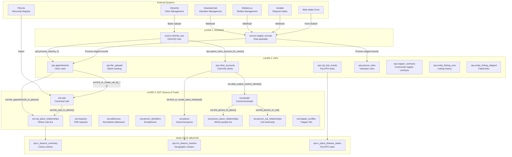
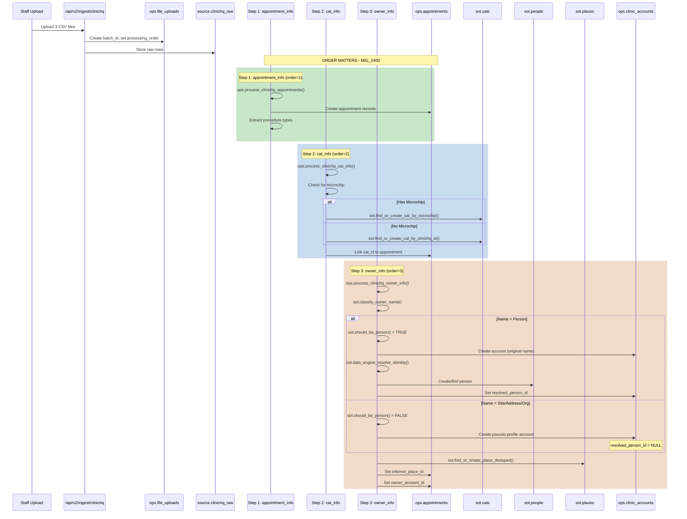
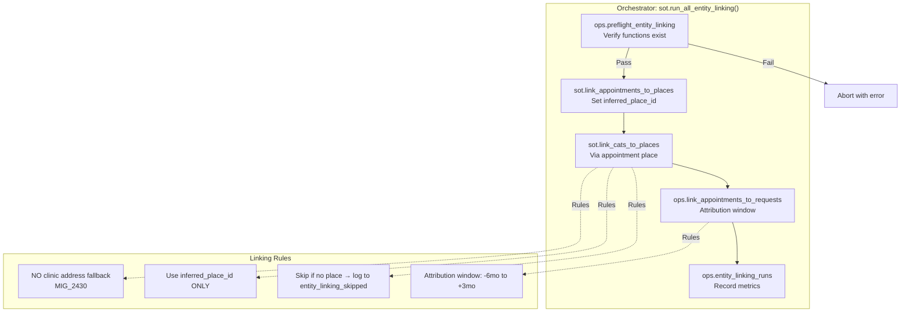
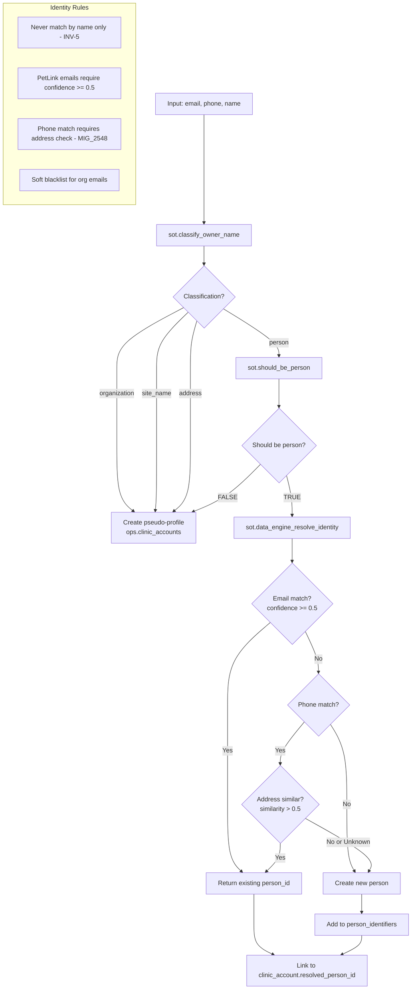
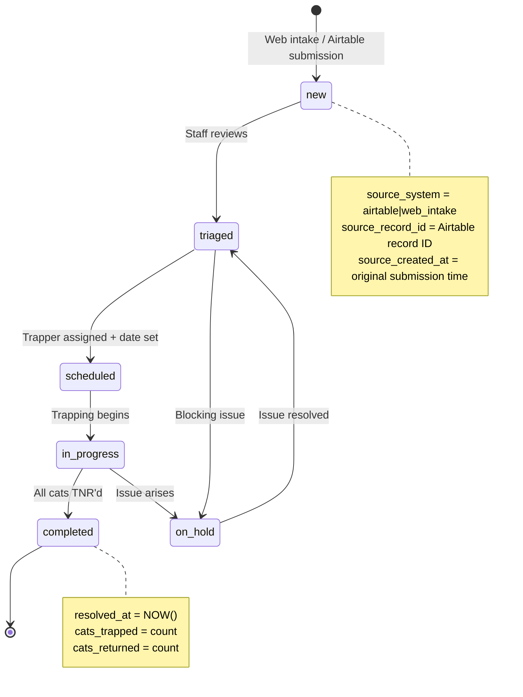
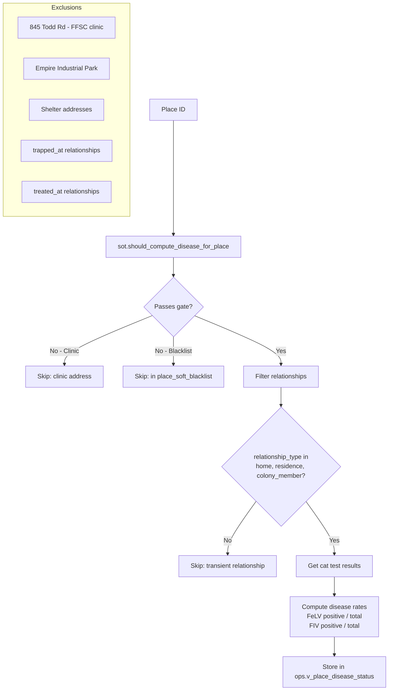
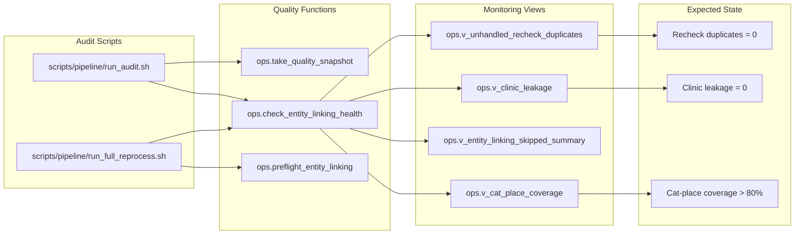
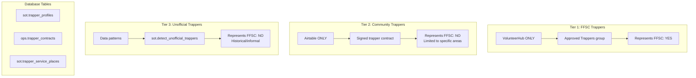

# Atlas Data Flow Architecture

High-resolution diagram showing how data flows through the 3-layer architecture.

## System Overview



## ClinicHQ Batch Processing Flow

The most complex data flow - processing clinic appointment data:



## Entity Linking Pipeline



## Identity Resolution Flow



## Request Lifecycle



## Cat-Request Attribution

```mermaid
flowchart LR
    subgraph "Request Timeline"
        REQ_CREATE[Request Created<br/>source_created_at]
        REQ_RESOLVE[Request Resolved<br/>resolved_at]
    end

    subgraph "Attribution Window"
        W1[6 months BEFORE]
        W2[DURING request]
        W3[3 months AFTER]
    end

    subgraph "Matching Logic"
        APPT[Appointment<br/>appointment_date]
        CAT[Cat record]
        PLACE[Place match<br/>inferred_place_id]
    end

    REQ_CREATE --> W1
    REQ_CREATE --> W2
    REQ_RESOLVE --> W3

    W1 --> APPT
    W2 --> APPT
    W3 --> APPT

    APPT --> PLACE
    PLACE -->|Same place| LINK[Link cat to request]

    Note: Uses COALESCE(source_created_at, created_at) for legacy Airtable dates
```

## Disease Computation Flow



## Data Quality Pipeline



## Merge Chain (No Data Disappears)

```mermaid
flowchart LR
    subgraph "Before Merge"
        L1[Person A<br/>id: abc-123]
        W1[Person B<br/>id: def-456]
    end

    subgraph "After Merge"
        L2[Person A<br/>id: abc-123<br/>merged_into_person_id: def-456]
        W2[Person B<br/>id: def-456<br/>merged_into_person_id: NULL]
    end

    subgraph "Query Filter"
        Q1["WHERE merged_into_person_id IS NULL"]
    end

    L1 -->|sot.merge_person_into| L2
    W1 -->|Unchanged| W2

    W2 --> Q1
    L2 -.->|Filtered out| Q1

    Note: All FKs pointing to Person A are updated to Person B
```

## Three-Tier Trapper Authority



## Key Data Flow Rules

| Rule | Enforcement |
|------|-------------|
| **Processing Order** | appointment_info → cat_info → owner_info (MIG_2400) |
| **No Clinic Fallback** | Skip cat if no inferred_place_id (MIG_2430) |
| **Confidence Filter** | PetLink emails require >= 0.5 |
| **Phone + Address** | Phone match requires address similarity check |
| **Place Links to Address** | Every place MUST have sot_address_id (MIG_2562) |
| **Attribution Window** | -6 months to +3 months around request lifecycle |
| **Merge Chains** | Never hard delete, set merged_into_*_id |
