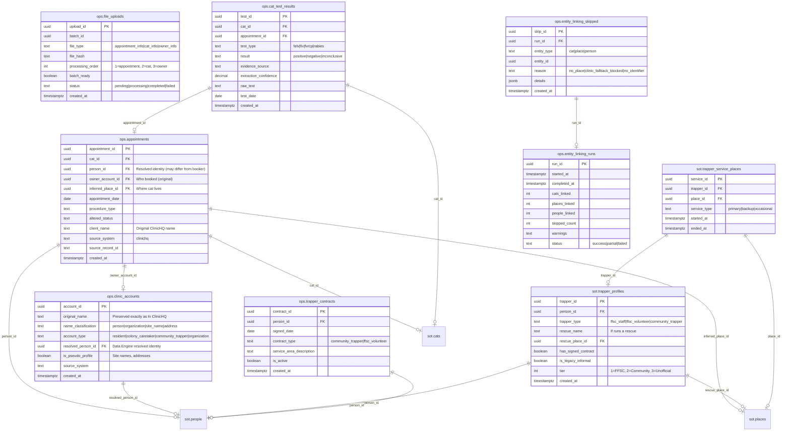
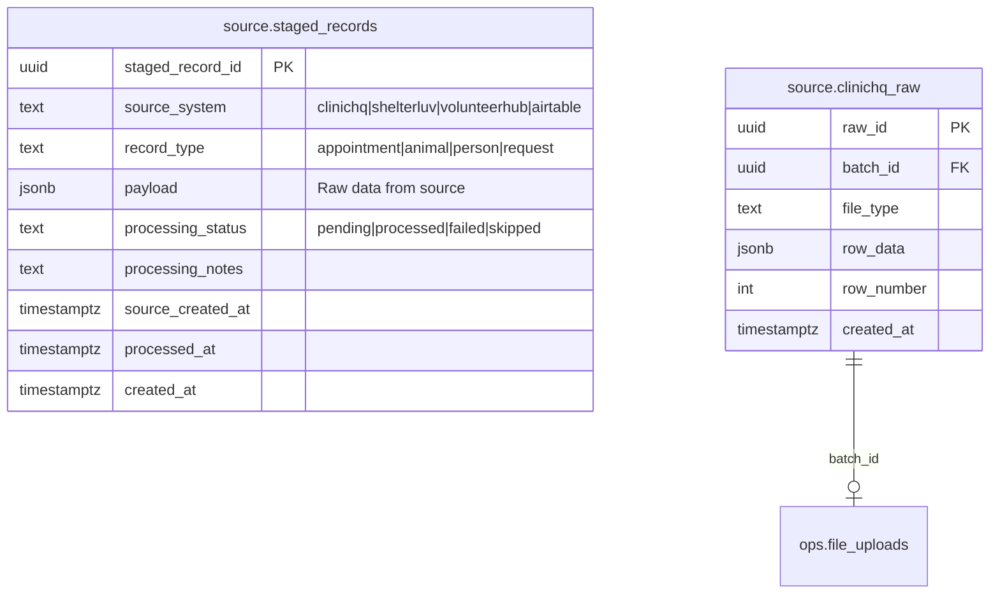

# Atlas Entity Relationship Diagram

High-resolution ERD showing all entities, relationships, and key columns.

## Core Entities (SOT Layer)

```mermaid
erDiagram
    %% ============================================================
    %% CORE ENTITIES - sot schema
    %% ============================================================

    sot.people {
        uuid person_id PK
        text display_name
        text account_type "resident|colony_caretaker|community_trapper|rescue_operator|organization"
        boolean is_canonical
        uuid merged_into_person_id FK "Self-referential merge chain"
        uuid primary_address_id FK
        text source_system "clinichq|volunteerhub|airtable|shelterluv|web_intake"
        text source_record_id
        timestamptz source_created_at
        timestamptz created_at
        timestamptz updated_at
    }

    sot.cats {
        uuid cat_id PK
        text display_name
        text sex "male|female|unknown"
        text altered_status "altered|intact|unknown"
        text breed
        text microchip "15-digit ISO standard"
        text clinichq_animal_id "ClinicHQ Number field"
        text shelterluv_animal_id
        text airtable_id
        uuid merged_into_cat_id FK "Self-referential merge chain"
        text source_system
        text source_record_id
        timestamptz created_at
        timestamptz updated_at
    }

    sot.places {
        uuid place_id PK
        text display_name
        text formatted_address
        text place_kind "residential_house|apartment_unit|business|clinic|outdoor_site"
        uuid sot_address_id FK "REQUIRED - MIG_2562"
        decimal latitude
        decimal longitude
        text locality "City name"
        text postal_code
        uuid merged_into_place_id FK "Self-referential merge chain"
        boolean requires_unit_selection "Multi-unit places"
        text source_system
        timestamptz created_at
    }

    sot.addresses {
        uuid address_id PK
        text formatted_address
        text street_number
        text route
        text locality
        text admin_area_1
        text postal_code
        text country
        decimal latitude
        decimal longitude
        text place_id_google "Google Places ID"
        timestamptz created_at
    }

    ops.requests ||--o| sot.places : "place_id"
    ops.requests ||--o| sot.people : "requester_person_id"
    ops.requests ||--o| sot.people : "assigned_to"

    ops.requests {
        uuid request_id PK
        text status "new|triaged|scheduled|in_progress|completed|cancelled|on_hold"
        text priority "urgent|high|normal|low"
        text summary
        int estimated_cat_count "Cats needing TNR"
        int total_cats_reported "Colony size"
        boolean has_kittens
        uuid place_id FK
        uuid requester_person_id FK
        uuid assigned_to FK
        timestamptz scheduled_date
        timestamptz resolved_at
        text source_system
        text source_record_id
        timestamptz source_created_at
        timestamptz created_at
    }

    %% ============================================================
    %% RELATIONSHIP TABLES - Junction tables
    %% ============================================================

    sot.person_cat {
        uuid person_cat_id PK
        uuid person_id FK
        uuid cat_id FK
        text relationship_type "owner|caretaker|feeder|foster|adopter"
        text evidence_type "source_record|inference|manual"
        decimal confidence
        timestamptz started_at
        timestamptz ended_at
        text source_system
    }

    sot.cat_place {
        uuid cat_place_id PK
        uuid cat_id FK
        uuid place_id FK
        text relationship_type "home|residence|colony_member|trapped_at|treated_at"
        text evidence_type "source_record|inference|manual"
        decimal confidence
        timestamptz first_seen
        timestamptz last_seen
        text source_system
    }

    sot.person_place {
        uuid person_place_id PK
        uuid person_id FK
        uuid place_id FK
        text relationship_type "owner|resident|landlord|caretaker|colony_caretaker"
        decimal confidence
        timestamptz started_at
        timestamptz ended_at
        text source_system
    }

    %% ============================================================
    %% IDENTITY LAYER
    %% ============================================================

    sot.person_identifiers {
        uuid identifier_id PK
        uuid person_id FK
        text identifier_type "email|phone|volunteerhub_id|clinichq_client_id"
        text identifier_value
        decimal confidence "PetLink emails < 0.5"
        boolean is_verified
        text source_system
        timestamptz created_at
    }

    sot.households {
        uuid household_id PK
        text name
        timestamptz created_at
    }

    sot.household_members {
        uuid member_id PK
        uuid household_id FK
        uuid person_id FK
        text role "head|spouse|child|other"
        timestamptz joined_at
    }

    %% ============================================================
    %% RELATIONSHIPS
    %% ============================================================

    sot.people ||--o{ sot.person_identifiers : "has"
    sot.people ||--o{ sot.person_cat : "owns/cares for"
    sot.people ||--o{ sot.person_place : "lives at/manages"
    sot.people ||--o| sot.addresses : "primary_address_id"

    sot.cats ||--o{ sot.person_cat : "owned by"
    sot.cats ||--o{ sot.cat_place : "lives at"

    sot.places ||--o{ sot.cat_place : "contains"
    sot.places ||--o{ sot.person_place : "occupied by"
    sot.places ||--o| sot.addresses : "sot_address_id"

    sot.household_members ||--o| sot.households : "belongs to"
    sot.household_members ||--o| sot.people : "is"
```

## Operational Layer (OPS Schema)

## Source Layer (Staging)

## Key Invariants

| Rule | Enforcement |
|------|-------------|
| **Merge chains** | `merged_into_*_id` - never hard delete |
| **Confidence filter** | `person_identifiers.confidence >= 0.5` for PetLink |
| **Address required** | `sot.places.sot_address_id` MUST be set (MIG_2562) |
| **Place is anchor** | Cat location via `inferred_place_id`, NOT person->place |
| **Single write path** | Use `find_or_create_*` functions only |
