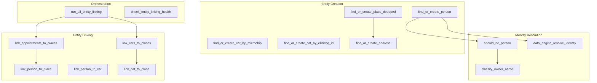

# Atlas SQL Functions Map

High-resolution map of all critical SQL functions with signatures, parameters, and return types.

## Entity Creation Functions (MANDATORY)

These are the ONLY valid paths for creating core entities. Never INSERT directly.

### sot.find_or_create_person
```sql
-- Location: sql/schema/v2/MIG_2020__fix_person_id_ambiguity.sql:264
-- Purpose: Create or find existing person by email/phone identity

FUNCTION sot.find_or_create_person(
    p_email           TEXT,                    -- Primary identifier (high priority)
    p_phone           TEXT,                    -- Secondary identifier
    p_first_name      TEXT,                    -- Display name component
    p_last_name       TEXT,                    -- Display name component
    p_address         TEXT,                    -- For primary_address_id lookup
    p_source_system   TEXT,                    -- clinichq|airtable|shelterluv|web_intake
    p_source_record_id TEXT DEFAULT NULL
) RETURNS UUID                                 -- person_id

-- Internal flow:
-- 1. Calls should_be_person() gate
-- 2. Calls data_engine_resolve_identity()
-- 3. Creates person_identifiers records
-- 4. Links to primary_address_id if address provided
```

### sot.find_or_create_cat_by_microchip
```sql
-- Location: sql/schema/v2/MIG_2340__backfill_microchip_on_return.sql:20
-- Purpose: Create or find cat using microchip as primary identifier

FUNCTION sot.find_or_create_cat_by_microchip(
    p_microchip       TEXT,                    -- 15-digit ISO microchip
    p_name            TEXT DEFAULT NULL,       -- Display name
    p_sex             TEXT DEFAULT 'unknown',  -- male|female|unknown
    p_breed           TEXT DEFAULT NULL,
    p_color           TEXT DEFAULT NULL,
    p_altered_status  TEXT DEFAULT 'unknown',
    p_source_system   TEXT DEFAULT 'clinichq',
    p_source_record_id TEXT DEFAULT NULL,
    p_clinichq_animal_id TEXT DEFAULT NULL     -- ClinicHQ Number field
) RETURNS UUID                                 -- cat_id

-- Matching priority:
-- 1. Exact microchip match
-- 2. If no match, create new cat with microchip
```

### sot.find_or_create_cat_by_clinichq_id
```sql
-- Location: sql/schema/v2/MIG_2460__find_or_create_cat_by_clinichq_id.sql:23
-- Purpose: Create cats WITHOUT microchip (euthanasia, kittens died)

FUNCTION sot.find_or_create_cat_by_clinichq_id(
    p_clinichq_animal_id TEXT,                 -- ClinicHQ Number (required)
    p_name            TEXT DEFAULT NULL,
    p_sex             TEXT DEFAULT 'unknown',
    p_breed           TEXT DEFAULT NULL,
    p_color           TEXT DEFAULT NULL,
    p_altered_status  TEXT DEFAULT 'unknown',
    p_source_system   TEXT DEFAULT 'clinichq',
    p_source_record_id TEXT DEFAULT NULL
) RETURNS UUID                                 -- cat_id

-- Use case: Cats that never get microchipped (euthanasia before chip)
```

### sot.find_or_create_place_deduped
```sql
-- Location: sql/schema/v2/MIG_2563__fix_place_address_linking.sql:35
-- Purpose: Create place with guaranteed sot_address_id linking

FUNCTION sot.find_or_create_place_deduped(
    p_formatted_address TEXT,                  -- Full address string
    p_display_name    TEXT DEFAULT NULL,       -- Custom display name
    p_latitude        DECIMAL DEFAULT NULL,
    p_longitude       DECIMAL DEFAULT NULL,
    p_source_system   TEXT DEFAULT 'atlas_ui',
    p_place_kind      TEXT DEFAULT 'unknown'
) RETURNS UUID                                 -- place_id

-- Critical (MIG_2562-2565):
-- ALWAYS calls sot.find_or_create_address() internally
-- Guarantees sot_address_id is set
```

### sot.find_or_create_address
```sql
-- Location: sql/schema/v2/MIG_2562__find_or_create_address.sql:23
-- Purpose: Canonical address deduplication

FUNCTION sot.find_or_create_address(
    p_formatted_address TEXT,
    p_street_number   TEXT DEFAULT NULL,
    p_route           TEXT DEFAULT NULL,
    p_locality        TEXT DEFAULT NULL,
    p_admin_area_1    TEXT DEFAULT NULL,
    p_postal_code     TEXT DEFAULT NULL,
    p_country         TEXT DEFAULT 'USA',
    p_latitude        DECIMAL DEFAULT NULL,
    p_longitude       DECIMAL DEFAULT NULL,
    p_place_id_google TEXT DEFAULT NULL
) RETURNS UUID                                 -- address_id

-- Deduplication: Matches on normalized formatted_address
```

## Entity Linking Functions

### sot.link_person_to_place
```sql
-- Location: sql/schema/v2/MIG_2022__fix_confidence_type_mismatch.sql:49
-- Purpose: Create person-place relationship with evidence tracking

FUNCTION sot.link_person_to_place(
    p_person_id       UUID,
    p_place_id        UUID,
    p_relationship_type TEXT,                  -- owner|resident|landlord|caretaker
    p_confidence      NUMERIC DEFAULT 0.8,     -- 0.0 to 1.0
    p_evidence_type   TEXT DEFAULT 'inference',-- source_record|inference|manual
    p_source_system   TEXT DEFAULT NULL,
    p_started_at      TIMESTAMPTZ DEFAULT NOW()
) RETURNS UUID                                 -- person_place_id

-- Upserts: Updates existing relationship if found
```

### sot.link_person_to_cat
```sql
-- Location: sql/schema/v2/MIG_2022__fix_confidence_type_mismatch.sql:111
-- Purpose: Create person-cat relationship

FUNCTION sot.link_person_to_cat(
    p_person_id       UUID,
    p_cat_id          UUID,
    p_relationship_type TEXT,                  -- owner|caretaker|feeder|foster
    p_confidence      NUMERIC DEFAULT 0.8,
    p_evidence_type   TEXT DEFAULT 'inference',
    p_source_system   TEXT DEFAULT NULL
) RETURNS UUID                                 -- person_cat_id
```

### sot.link_cat_to_place
```sql
-- Location: sql/schema/v2/MIG_2022__fix_confidence_type_mismatch.sql:173
-- Purpose: Create cat-place relationship

FUNCTION sot.link_cat_to_place(
    p_cat_id          UUID,
    p_place_id        UUID,
    p_relationship_type TEXT,                  -- home|residence|colony_member|trapped_at
    p_confidence      NUMERIC DEFAULT 0.8,
    p_evidence_type   TEXT DEFAULT 'inference',
    p_source_system   TEXT DEFAULT NULL,
    p_first_seen      TIMESTAMPTZ DEFAULT NOW()
) RETURNS UUID                                 -- cat_place_id

-- CRITICAL (MIG_2430): Never COALESCE to clinic address
```

### sot.link_cats_to_places
```sql
-- Location: sql/schema/v2/MIG_2601__place_kind_filter_in_cat_linking.sql:31
-- Purpose: Batch entity linking for all unlinked cats

FUNCTION sot.link_cats_to_places() RETURNS TABLE(
    cats_processed INT,
    cats_linked INT,
    cats_skipped INT
)

-- Rules:
-- 1. Uses inferred_place_id from appointment ONLY
-- 2. NO clinic fallback (prevents pollution)
-- 3. Logs skipped entities to ops.entity_linking_skipped
-- 4. Excludes place_kind = 'clinic'
```

### sot.link_appointments_to_places
```sql
-- Location: sql/schema/v2/MIG_2431__fix_silent_null_updates.sql:27
-- Purpose: Set inferred_place_id on appointments

FUNCTION sot.link_appointments_to_places() RETURNS TABLE(
    appointments_processed INT,
    appointments_linked INT
)

-- Uses person→place relationship to infer appointment location
```

## Identity Resolution Functions

### sot.data_engine_resolve_identity
```sql
-- Location: sql/schema/v2/MIG_2021__fix_person_place_column_names.sql:268
-- Purpose: THE fortress for identity resolution

FUNCTION sot.data_engine_resolve_identity(
    p_email           TEXT,
    p_phone           TEXT,
    p_first_name      TEXT DEFAULT NULL,
    p_last_name       TEXT DEFAULT NULL,
    p_source_system   TEXT DEFAULT NULL
) RETURNS UUID                                 -- person_id or NULL

-- Rules:
-- 1. Email match first (confidence >= 0.5)
-- 2. Phone match requires address similarity check (MIG_2548)
-- 3. Respects soft blacklist for org emails
-- 4. Returns NULL if no match (don't force bad matches)
```

### sot.should_be_person
```sql
-- Location: sql/schema/v2/MIG_1011_v2__standalone_identity.sql:238
-- Purpose: Gate function - should this create a person record?

FUNCTION sot.should_be_person(
    p_display_name    TEXT,
    p_email           TEXT DEFAULT NULL,
    p_phone           TEXT DEFAULT NULL
) RETURNS BOOLEAN

-- Returns FALSE for:
-- - Organization names (businesses, rescues)
-- - Site names (Silveira Ranch, etc)
-- - Address-as-name patterns
-- - Soft-blacklisted org emails
```

### sot.classify_owner_name
```sql
-- Location: sql/schema/v2/MIG_2498__fix_classification_edge_cases.sql:28
-- Purpose: Classify a name string

FUNCTION sot.classify_owner_name(
    p_display_name TEXT
) RETURNS TEXT                                 -- person|organization|site_name|address|garbage

-- Uses reference tables:
-- - Census surname data
-- - SSA first name data
-- - Business keyword patterns
```

### sot.get_email / sot.get_phone
```sql
-- Location: sql/schema/v2/MIG_2421__confidence_helper_function.sql:33-43
-- Purpose: Get high-confidence identifier (>= 0.5)

FUNCTION sot.get_email(p_person_id UUID) RETURNS TEXT
FUNCTION sot.get_phone(p_person_id UUID) RETURNS TEXT

-- Always use these instead of inline confidence filters
```

## Batch Processing Functions

### ops.process_clinichq_cat_info
```sql
-- Location: sql/schema/v2/MIG_2441__migrate_unchipped_cat_processing.sql:166
-- Purpose: Process cat_info file records

FUNCTION ops.process_clinichq_cat_info(
    p_batch_id UUID
) RETURNS TABLE(
    processed INT,
    created INT,
    updated INT,
    skipped INT,
    errors TEXT[]
)

-- Processing order: AFTER appointment_info (uses existing appointments)
```

### ops.process_clinichq_owner_info
```sql
-- Location: sql/schema/v2/MIG_2441__migrate_unchipped_cat_processing.sql:271
-- Purpose: Process owner_info file records

FUNCTION ops.process_clinichq_owner_info(
    p_batch_id UUID
) RETURNS TABLE(
    processed INT,
    people_created INT,
    places_created INT,
    accounts_created INT
)

-- Processing order: AFTER cat_info (links to existing appointments)
-- Creates ops.clinic_accounts for ALL owners
```

### ops.upsert_clinic_account_for_owner
```sql
-- Location: sql/schema/v2/MIG_2489__* (referenced)
-- Purpose: Create/update clinic account preserving original name

FUNCTION ops.upsert_clinic_account_for_owner(
    p_original_name   TEXT,
    p_email           TEXT DEFAULT NULL,
    p_phone           TEXT DEFAULT NULL,
    p_address         TEXT DEFAULT NULL,
    p_source_record_id TEXT DEFAULT NULL
) RETURNS UUID                                 -- account_id

-- Preserves original ClinicHQ client name
-- Runs classification but stores original
```

## Entity Linking Orchestration

### sot.run_all_entity_linking
```sql
-- Location: sql/schema/v2/MIG_2432__orchestrator_validation.sql:52
-- Purpose: Master orchestrator for all entity linking

FUNCTION sot.run_all_entity_linking() RETURNS TABLE(
    step TEXT,
    result TEXT,
    duration INTERVAL
)

-- Execution order:
-- 1. ops.preflight_entity_linking() - validate functions exist
-- 2. sot.link_appointments_to_places()
-- 3. sot.link_cats_to_places()
-- 4. ops.link_appointments_to_requests()
-- 5. Log run to ops.entity_linking_runs
```

### ops.check_entity_linking_health
```sql
-- Location: sql/schema/v2/MIG_2435__* (referenced)
-- Purpose: Return health metrics for entity linking

FUNCTION ops.check_entity_linking_health() RETURNS TABLE(
    metric TEXT,
    value NUMERIC,
    status TEXT                                -- healthy|warning|critical
)

-- Metrics:
-- - clinic_leakage (cats linked to clinic addresses - should be 0)
-- - cat_place_coverage (% of cats with place)
-- - appointment_place_coverage
-- - skipped_entity_count
```

## Disease & Ecological Functions

### sot.should_compute_disease_for_place
```sql
-- Location: sql/schema/v2/MIG_2304__* (referenced)
-- Purpose: Gate for disease computation

FUNCTION sot.should_compute_disease_for_place(
    p_place_id UUID
) RETURNS BOOLEAN

-- Returns FALSE for:
-- - Clinic addresses (845 Todd Rd, Empire Industrial)
-- - Shelter addresses
-- - Places in sot.place_soft_blacklist
```

## Trapper Functions

### sot.detect_unofficial_trappers
```sql
-- Location: sql/schema/v2/MIG_2488__fix_trapper_source_rules.sql:88
-- Purpose: Find Tier 3 (unofficial) trappers from data patterns

FUNCTION sot.detect_unofficial_trappers(
    p_min_appointments INT DEFAULT 10,         -- Minimum to qualify
    p_min_places INT DEFAULT 3                 -- From multiple places
) RETURNS TABLE(
    person_id UUID,
    display_name TEXT,
    appointment_count INT,
    place_count INT,
    confidence NUMERIC
)

-- Detects people with many appointments from multiple addresses
-- Who are NOT in VolunteerHub or Airtable trappers list
```

## Helper Functions

### sot.get_place_family
```sql
-- Location: sql/schema/v2/MIG_2301__add_missing_functions.sql (referenced)
-- Purpose: Get all related places (parent, children, siblings)

FUNCTION sot.get_place_family(
    p_place_id UUID
) RETURNS UUID[]                               -- Array of place_ids

-- Returns: parent, children, siblings, co-located places
-- Use instead of arbitrary ST_DWithin radius queries
```

### sot.merge_person_into
```sql
-- Location: sql/schema/v2/MIG_2044__merge_person_into.sql:12
-- Purpose: Merge duplicate person records

FUNCTION sot.merge_person_into(
    p_loser_id UUID,                           -- Will be merged away
    p_winner_id UUID,                          -- Will survive
    p_reason TEXT DEFAULT NULL,
    p_changed_by UUID DEFAULT NULL
) RETURNS BOOLEAN

-- Updates all FKs to winner
-- Sets loser.merged_into_person_id = winner
-- Does NOT delete loser (preserves audit trail)
```

### ops.take_quality_snapshot
```sql
-- Location: sql/schema/v2/MIG_2301__add_missing_functions.sql:254
-- Purpose: Capture data quality metrics

FUNCTION ops.take_quality_snapshot(
    p_source TEXT DEFAULT 'api'
) RETURNS UUID                                 -- snapshot_id

-- Captures counts, coverage rates, error counts
-- Used for trend analysis
```

## Function Dependency Graph


